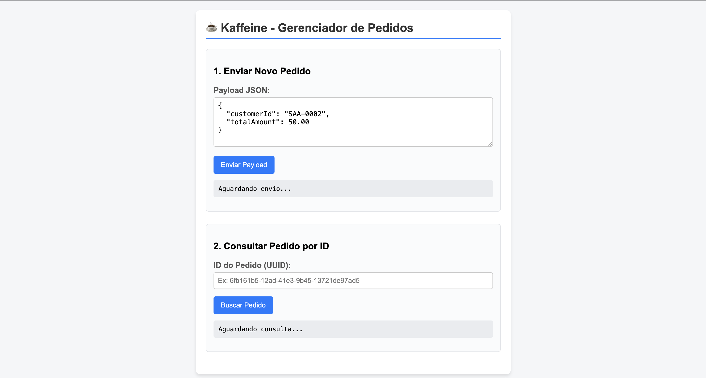
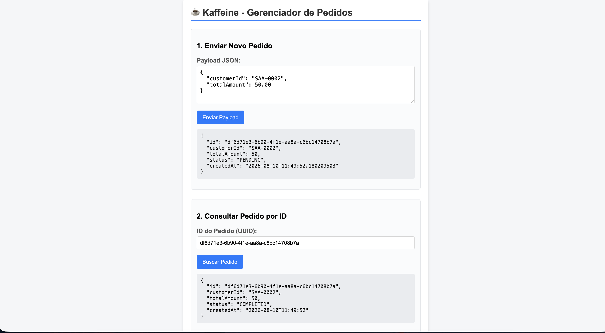

# ☕ Kaffeine Shop (Backend API)

API de comércio eletrônico robusta e resiliente desenvolvida com **Quarkus (Java 21)**, projetada para alta performance, integração em tempo real com **Apache Kafka** e persistência segura em banco de dados relacional na nuvem.

🔗 **Acesse a aplicação em produção:** [https://kaffeine-shop.onrender.com](https://kaffeine-shop.onrender.com)

---

## 📸 Demonstração Funcional

> *Visão geral da interface e funcionamento da aplicação integrada com mensageria e banco de dados em nuvem.*

|                         Tela Inicial / Catálogo                          |          Fluxo de Pedidos / Eventos Kafka          |
|:------------------------------------------------------------------------:|:--------------------------------------------------:|
|  |  |

---

## 🚀 Tecnologias e Arquitetura

* **Java 21** & **Quarkus 3.x** (Fast JAR)
* **Apache Kafka** (SmallRye Reactive Messaging - Mensageria assíncrona)
* **Hibernate ORM / Panache** & **Flyway** (Gerenciamento de migrações e persistência)
* **MySQL (Aiven Cloud)** (Banco de dados relacional)
* **Docker & Dockerfile multi-stage** (Empacotamento e otimização para containers)
* **Render** (Plataforma de Deploy em nuvem)

---

## 🔒 Segurança e Conectividade (Aiven Cloud)

A aplicação se conecta a serviços gerenciados na Aiven utilizando segurança avançada:
* **Banco de Dados:** Conexão JDBC segura com credenciais isoladas via variáveis de ambiente.
* **Kafka:** Conectividade protegida utilizando protocolo `SASL_SSL` (mecanismo `PLAIN`) e validação de certificados via arquivo truststore JKS (`client.truststore.jks`).

---

## ⚙️ Configuração e Variáveis de Ambiente

Para rodar a aplicação localmente ou em produção, as seguintes variáveis de ambiente devem ser configuradas:

| Variável | Descrição |
| :--- | :--- |
| `AIVEN_URL_BROKER` | Endereço dos brokers do Kafka (Aiven) |
| `AIVEN_AIVEN_PASSWORD` | Senha de autenticação do Kafka (SASL/PLAIN) |
| `AIVEN_USER` | Usuário do banco de dados MySQL |
| `AIVEN_PASSWORD` | Senha do banco de dados MySQL |
| `AIVEN_URL_DB` | URL de conexão JDBC do MySQL |
| `AIVEN_KEY_SET_ONE` | Senha do Truststore JKS do Kafka |

---

## 🛠️ Como Executar Localmente

### Pré-requisitos
* JDK 21 instalado
* Maven 3.9+ instalado
* Docker (opcional)

### Passo a passo:
1. Clone o repositório:
   ```bash
   git clone [https://github.com/LeynnerRoque/kaffeine-shop.git](https://github.com/LeynnerRoque/kaffeine-shop.git)
   cd kaffeine-shop